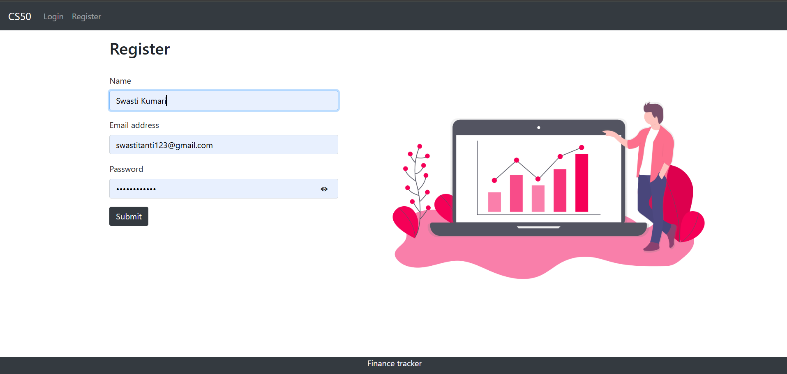
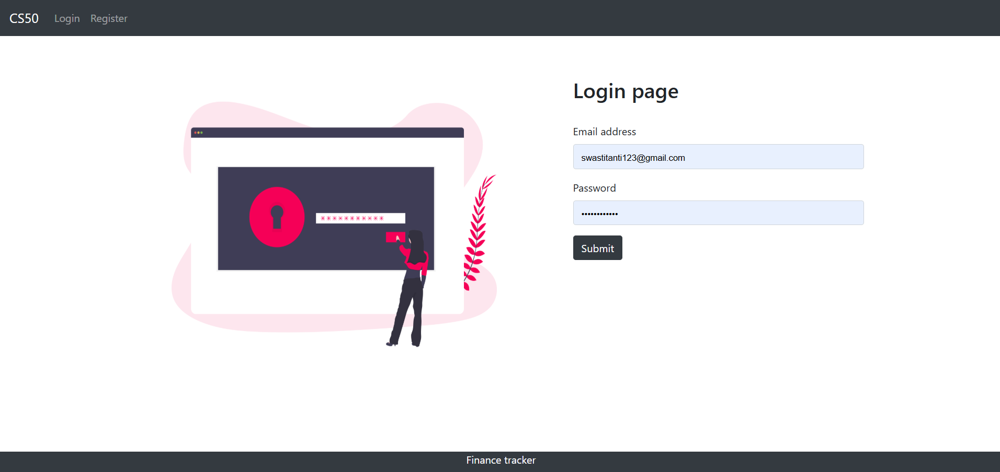
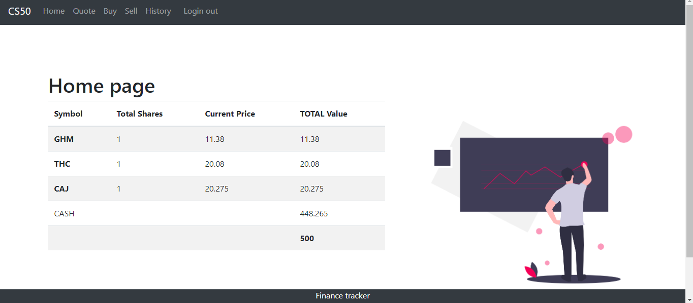
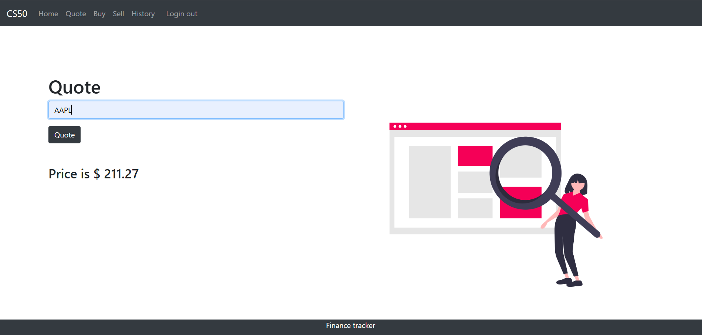
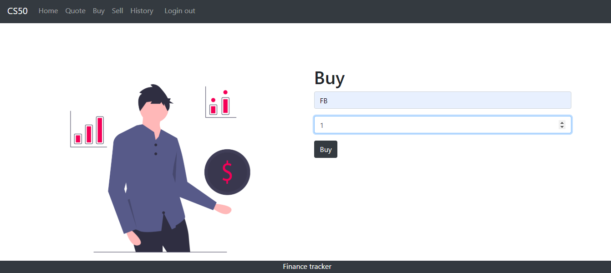
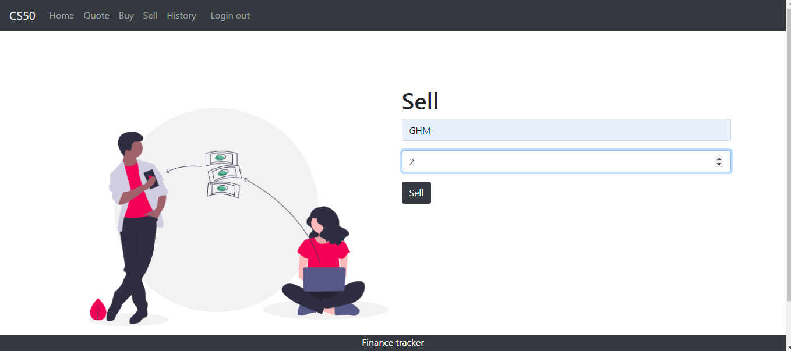
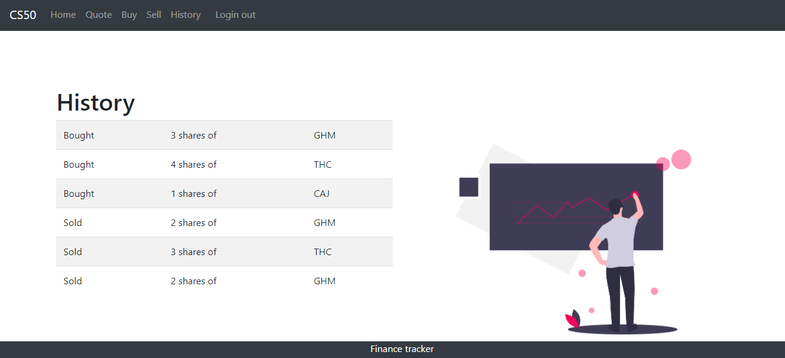

# 💸 Finance Tracker

**Finance Tracker** is a web-based application created as the final project for CS50x. It enables users to manage their personal stock portfolios with real-time market data. Users can register for an account, get stock quotes, buy and sell shares, and view a full history of their transactions. The app also tracks the user’s current balance and stock holdings in a dynamic dashboard.

This project simulates a stock trading experience using live market data fetched via the [Financial Modeling Prep API](https://financialmodelingprep.com/developer/docs/). The backend is built with Flask and SQLAlchemy, with authentication handled using secure Argon2 hashing.

---

## 🧠 Project Functionality

- Register: Any person can register to make a new account.
- Quote: A registered user can quote a price for a stock.
- Buy: Users can buy shares for a price.
- Index: Shows the stocks in the user's account.
- Sell: Users can sell shares of a stock.
- History: Users can view past transaction history.

---

## video
- link: [Video Demo] (https://www.youtube.com/watch?v=Rx3nL4mobQo)

---

## 🚀 Features

- 🔐 User Registration & Login (hashed passwords using Argon2)
- 💵 Simulated Cash Balance & Stock Transactions
- 📈 Real-time Stock Quote Lookup
- 📊 Transaction History & Portfolio Overview
- 📉 Error Handling & 404 Support

---

## 🛠️ Tech Stack

- **Frontend**: HTML, CSS (Bootstrap 5), JavaScript
- **Backend**: Flask (Python), SQLAlchemy
- **Database**: SQLite (`db.sqlite3`)
- **API**: [Financial Modeling Prep](https://financialmodelingprep.com/developer/docs)
- **Auth**: Argon2 for secure password hashing

---

### 📝 Register


### 🔐 Login


### 🏠 Home (Dashboard)


### 💬 Quote


### 🛒 Buy Stocks


### 💼 Sell Stocks


### 📜 Transaction History


---

## ⚙️ Setup Instructions (Local)

1. Clone the project:
   ```bash
   git clone https://github.com/Swastitanti/CS50-Finance.git
   cd finance-project

---

## Installation-

### 1. Download and unzip the project files provided by CS50
wget https://cdn.cs50.net/2024/fall/psets/9/finance.zip
unzip finance.zip
cd finance

### 2. Create and activate a virtual environment
python -m venv venv
venv\Scripts\activate   # For Windows

### 3. Install required packages
pip install flask flask_sqlalchemy argon2-cffi

### 4. Freeze dependencies into requirements.txt
pip freeze > requirements.txt

### 5. Rename the main application file (if needed)
ren app.py main.py   # Use 'mv app.py main.py' for Mac/Linux

### 6. Create the SQLite database (this will auto-generate db.sqlite3)
sqlite3 db.sqlite3
.exit

### 7. Run the Flask application
python main.py
### OR
flask --app main run
